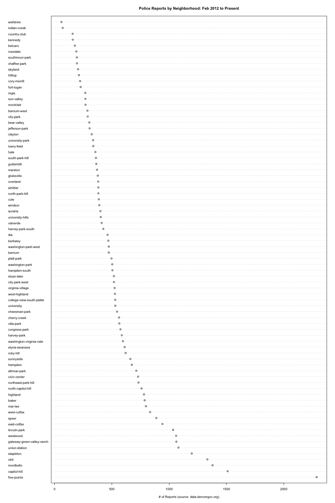
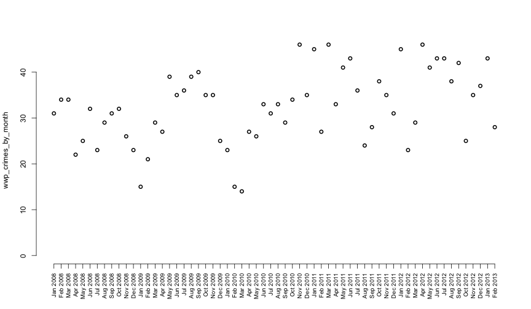
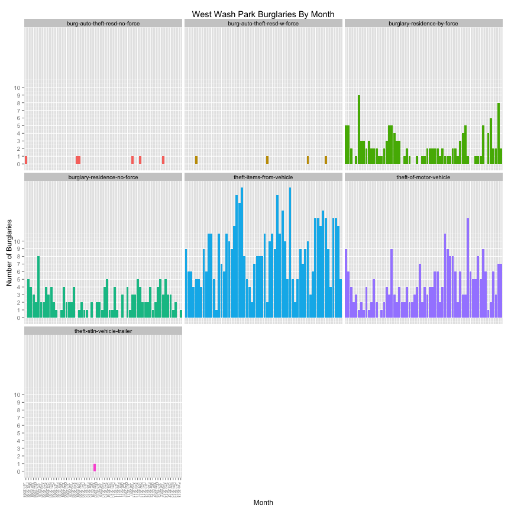
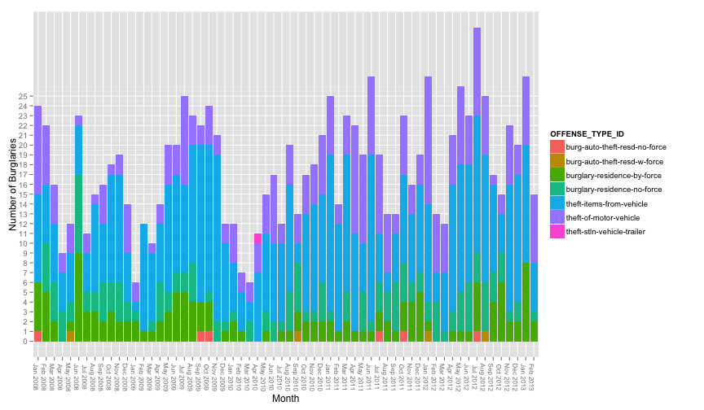

Raw Analysis of West Washington Park Neighborhood Crime Data
========================================================

Set up required libraries:


```r
library(data.table)
library(zoo)
```

```
## Attaching package: 'zoo'
```

```
## The following object(s) are masked from 'package:base':
## 
## as.Date, as.Date.numeric
```

```r
library(ggplot2)
```


Processing
----------

Download the data file, read the data and save a .rda file.


```r
use_cached = TRUE
csv_file = "../data/crime.csv"
rda_file = "../data/crimeRaw.rda"
# Use cached file because it's a big download
if (!file.exists(csv_file) && !useCached) {
    crimeURL <- "http://data.denvergov.org/download/gis/crime/csv/crime.csv"
    download.file(crimeURL, destfile = csv_file, method = "curl")
    downloadTimestamp <- date()
} else {
    downloadTimestamp <- file.info(csv_file)$ctime
}
if (!file.exists(rda_file) && !useCached) {
    crime <- read.csv(csv_file)
    crime <- data.table(crime)
    save(crime, downloadTimestamp, file = "../data/crimeRaw.rda")
} else load(rda_file)
```

Looking at the basic structure...

```r
summary(crime)
```

```
##   INCIDENT_ID         OFFENSE_ID        OFFENSE_CODE 
##  Min.   :2.01e+04   Min.   :2.01e+10   Min.   : 902  
##  1st Qu.:2.01e+09   1st Qu.:2.01e+15   1st Qu.:2204  
##  Median :2.01e+09   Median :2.01e+15   Median :2399  
##  Mean   :5.85e+09   Mean   :5.85e+15   Mean   :2547  
##  3rd Qu.:2.01e+09   3rd Qu.:2.01e+15   3rd Qu.:2999  
##  Max.   :2.01e+12   Max.   :2.01e+18   Max.   :7399  
##                                                      
##  OFFENSE_CODE_EXTENSION                    OFFENSE_TYPE_ID 
##  Min.   :0.000          theft-items-from-vehicle   :30443  
##  1st Qu.:0.000          theft-of-motor-vehicle     :18372  
##  Median :0.000          criminal-mischief-mtr-veh  :16379  
##  Mean   :0.287          theft-other                :14187  
##  3rd Qu.:0.000          burglary-residence-by-force:10948  
##  Max.   :5.000          criminal-mischief-other    : 8710  
##                         (Other)                    :94409  
##                OFFENSE_CATEGORY_ID         FIRST_OCCURRENCE_DATE
##  theft-from-motor-vehicle:36806    2011-04-07 12:00:00:    37   
##  public-disorder         :33818    2010-01-01 08:00:00:    33   
##  larceny                 :29953    2009-01-01 00:01:00:    32   
##  burglary                :25303    2009-01-01 00:00:00:    30   
##  auto-theft              :18762    2011-01-01 00:00:00:    30   
##  all-other-crimes        :10465    2010-01-01 12:00:00:    28   
##  (Other)                 :38341    (Other)            :193258   
##           LAST_OCCURRENCE_DATE             REPORTED_DATE   
##                     : 26969    2012-02-07 18:00:00:    60  
##  2011-04-08 12:00:00:    41    2012-04-20 09:59:59:    17  
##  2009-12-11 21:30:00:    20    2012-04-07 09:59:59:    10  
##  2011-04-18 18:59:59:    18    2008-03-18 10:27:00:     9  
##  2011-05-01 08:00:00:    16    2012-01-10 09:59:59:     7  
##  2011-04-23 12:00:00:    15    2012-02-23 23:35:59:     7  
##  (Other)            :166369    (Other)            :193338  
##            INCIDENT_ADDRESS      GEO_X             GEO_Y        
##                    : 12140   Min.   :1120080   Min.   :     31  
##  1331 N CHEROKEE ST:   826   1st Qu.:3136912   1st Qu.:1680885  
##  8400 PENA BLVD    :   531   Median :3145662   Median :1693914  
##  3000 E 1ST AVE    :   369   Mean   :3149945   Mean   :1690996  
##  7800 E SMITH RD   :   359   3rd Qu.:3159263   3rd Qu.:1701223  
##  8500 PENA BLVD    :   312   Max.   :3326314   Max.   :1766817  
##  (Other)           :178911                                      
##     GEO_LON        GEO_LAT      DISTRICT_ID     PRECINCT_ID    
##  Min.   :-112   Min.   :35.0   6      :45287   624    :  5756  
##  1st Qu.:-105   1st Qu.:39.7   4      :42242   431    :  5728  
##  Median :-105   Median :39.7   3      :41117   625    :  4915  
##  Mean   :-105   Mean   :39.7   1      :27272   322    :  4857  
##  3rd Qu.:-105   3rd Qu.:39.8   2      :22240   414    :  4788  
##  Max.   :-104   Max.   :39.9   5      :13838   623    :  4774  
##                                (Other): 1452   (Other):162630  
##       NEIGHBORHOOD_ID  
##  five-points  :  9044  
##  capitol-hill :  7181  
##  montbello    :  7016  
##  cbd          :  5761  
##  lincoln-park :  4876  
##  union-station:  4792  
##  (Other)      :154778
```


Clean up data
-------------

Get the information about when a crime was reported into a more usable format


```r
crime <- crime[, `:=`(REPORTED_DATE, as.POSIXct(REPORTED_DATE, format = "%Y-%m-%d %H:%M:%S", 
    tz = "MST"))]
crime <- crime[, `:=`(FIRST_OCCURRENCE_DATE, as.POSIXct(FIRST_OCCURRENCE_DATE, 
    format = "%Y-%m-%d %H:%M:%S", tz = "MST"))]
crime <- crime[, `:=`(year_month, as.yearmon(format(FIRST_OCCURRENCE_DATE)))]
```


Big Picture
-----------

Time frame for the data


```r
min(crime$REPORTED_DATE)
```

```
## [1] "2008-01-02 02:41:00 MST"
```

```r
max(crime$REPORTED_DATE)
```

```
## [1] "2013-02-28 23:19:00 MST"
```


Look at # of reports per neighborhood over the last 12 months


```r
year_ago = max(crime$year_month) - 1
crime_last_12_months = crime[year_month >= year_ago]
crime_by_neighborhood = sort(table(crime_last_12_months$NEIGHBORHOOD_ID), decreasing = TRUE)
title = paste("Police Reports by Neighborhood:", format(year_ago), "to Present")
dotchart(crime_by_neighborhood, labels = names(crime_by_neighborhood), main = title, 
    xlab = "# of Reports (source: data.denvergov.org)", cex = 0.7)
```

```
## Warning: 'x' is neither a vector nor a matrix: using as.numeric(x)
```

 


Drill down a little bit


```r
wwp_crime = crime[NEIGHBORHOOD_ID == "washington-park-west"]
wwp_crimes_by_month = table(wwp_crime$year_month)
plot(wwp_crimes_by_month, xaxt = "n", type = "p")
axis(side = 1, las = 2, labels = names(wwp_crimes_by_month), at = 1:length(wwp_crimes_by_month), 
    cex.axis = 0.8)
```

 


```r
wwp_thefts = wwp_crime[(OFFENSE_CATEGORY_ID == "burglary" | OFFENSE_CATEGORY_ID == 
    "theft-from-motor-vehicle" | OFFENSE_CATEGORY_ID == "auto-theft") & OFFENSE_TYPE_ID != 
    "burglary-business-by-force" & OFFENSE_TYPE_ID != "burglary-business-no-force" & 
    OFFENSE_TYPE_ID != "theft-parts-from-vehicle"]
ggplot(wwp_thefts, aes(factor(year_month), fill = OFFENSE_TYPE_ID)) + geom_bar() + 
    facet_wrap(~OFFENSE_TYPE_ID) + theme(axis.text.x = element_text(size = 6, 
    angle = -90), legend.position = "none") + ggtitle("West Wash Park Burglaries By Month") + 
    scale_y_continuous(breaks = 0:10) + xlab("Month") + ylab("Number of Burglaries")
```

 


```r
ggplot(wwp_thefts, aes(factor(year_month), fill = OFFENSE_TYPE_ID)) + geom_bar() + 
    theme(axis.text.x = element_text(size = 8, angle = -90)) + scale_y_continuous(breaks = 0:25) + 
    xlab("Month") + ylab("Number of Burglaries")
```

 

